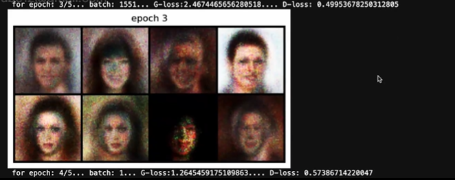

# Face Generation using Generative Adversarial Networks (GANs)

## Overview

This project implements a **Vanilla Generative Adversarial Network (GAN)** using PyTorch to generate human face images from random noise vectors. The model is trained on the **CelebA Dataset** containing more than 200,000 celebrity face images.

The project demonstrates the fundamental concepts behind Generative AI and adversarial learning by training two neural networks:

- **Generator** – Creates synthetic face images.
- **Discriminator** – Distinguishes between real and generated images.

Over time, the Generator learns to create increasingly realistic faces capable of fooling the Discriminator.

---

# Generated Face Samples



The generated faces are completely synthetic and are created from random latent vectors after adversarial training.

---

# Table of Contents

1. What is GAN?
2. GAN Architecture
3. Generator Network
4. Discriminator Network
5. Adversarial Training
6. Vanilla GAN Pipeline
7. DCGAN Pipeline
8. Vanilla GAN vs DCGAN
9. Dataset
10. Data Preprocessing
11. Project Workflow
12. Training Procedure
13. Loss Function
14. Hyperparameters
15. Results
16. Challenges
17. Future Improvements
18. Project Structure
19. Installation
20. Usage
21. References

---

# What is a GAN?

GAN stands for **Generative Adversarial Network**.

Introduced by Ian Goodfellow in 2014, GANs are deep learning models capable of generating entirely new data samples.

Applications:

- Face Generation
- Art Generation
- Data Augmentation
- Medical Imaging
- Image-to-Image Translation
- Deepfake Generation

A GAN consists of:

1. Generator (G)
2. Discriminator (D)

Both compete against each other during training.

---

# GAN Architecture

```text
Random Noise (z)
        |
        v
   Generator
        |
        v
 Fake Image
        |
        v
 Discriminator
        |
        v
 Real or Fake
```

---

# Generator Network

Input:

```text
100-dimensional latent vector
```

Output:

```text
64 × 64 × 3 RGB image
```

Architecture:

```text
100
 |
256
 |
512
 |
1024
 |
12288
 |
64×64×3
```

Activation Functions:

- ReLU
- Tanh

Tanh is used because images are normalized to the range [-1, 1].

---

# Discriminator Network

Input:

```text
64 × 64 × 3 image
```

Output:

```text
Probability between 0 and 1
```

Architecture:

```text
12288
 |
1024
 |
512
 |
256
 |
1
```

Activation Functions:

- LeakyReLU
- Sigmoid

---

# Adversarial Training

Step 1:
- Sample real images from CelebA.

Step 2:
- Generate fake images from random noise.

Step 3:
- Train Discriminator.

```text
Real Image -> Label 1
Fake Image -> Label 0
```

Step 4:
- Train Generator.

Goal:

```text
Discriminator(Fake Image) = 1
```

Step 5:
- Repeat for multiple epochs.

---

# Vanilla GAN Pipeline

```text
Noise Vector
      |
      v
Fully Connected Layers
      |
      v
Generated Face
      |
      v
Discriminator
      |
      v
Real / Fake
```

Characteristics:

- Dense layers only
- Simpler architecture
- Easier to understand
- Lower image quality compared to DCGAN

---

# DCGAN Pipeline

```text
Noise
 |
Dense
 |
Reshape
 |
ConvTranspose
 |
ConvTranspose
 |
Generated Image
```

Discriminator:

```text
Image
 |
Conv2D
 |
Conv2D
 |
Classifier
```

Advantages:

- Better image quality
- Better spatial learning
- More stable training

---

# Vanilla GAN vs DCGAN

| Feature | Vanilla GAN | DCGAN |
|----------|------------|--------|
| Layers | Dense | Convolution |
| Image Quality | Moderate | High |
| Stability | Lower | Better |
| Spatial Learning | Poor | Excellent |

---

# Dataset

## CelebA Dataset

Contains:

- 202,599 face images
- RGB images
- Celebrity faces
- Multiple attributes

Official Dataset:

http://mmlab.ie.cuhk.edu.hk/projects/CelebA.html

---

# Data Preprocessing

Original Size:

```text
178 × 218
```

Pipeline:

```text
Center Crop
    ↓
Resize to 64×64
    ↓
Convert to Tensor
    ↓
Normalize [-1,1]
```

Normalization:

```python
Normalize((0.5,0.5,0.5),(0.5,0.5,0.5))
```

---

# Project Workflow

```text
Load Dataset
      |
      v
Apply Transformations
      |
      v
Create DataLoader
      |
      v
Initialize Generator
      |
      v
Initialize Discriminator
      |
      v
Train GAN
      |
      v
Generate Faces
```

---

# Training Procedure

## Train Discriminator

```text
Real Images -> Label 1
Fake Images -> Label 0
```

Loss:

```text
(Real Loss + Fake Loss)/2
```

## Train Generator

Goal:

```text
Fool the Discriminator
```

Desired Output:

```text
1
```

---

# Loss Function

Binary Cross Entropy:

```python
nn.BCELoss()
```

Discriminator:

```text
D(real) = 1
D(fake) = 0
```

Generator:

```text
D(fake) = 1
```

---

# Hyperparameters

```python
Batch Size = 128
Latent Dimension = 100
Learning Rate = 0.0002
Optimizer = Adam
Epochs = 5
Image Size = 64x64
Channels = 3
```

---

# Results

## Epoch 2

```md

```

Observations:

- Basic face structures emerge.
- Hair regions become visible.
- Images remain blurry.

---

## Epoch 3

```md

```

Observations:

- Better facial alignment.
- Improved facial features.
- More realistic outputs.

---

## Training Summary

| Epoch | Observation |
|---------|------------|
| 1 | Very blurry |
| 2 | Face structure emerges |
| 3 | Better alignment |
| 4 | Better textures |
| 5 | Best generated output |

---

# Challenges Faced

- GAN instability
- Mode collapse risk
- Blurry image generation
- Generator–Discriminator imbalance
- Long training times

---

# Future Improvements

## DCGAN

Use convolutional layers for:

- Better textures
- Sharper images

## WGAN

- Improved stability
- Reduced mode collapse

## Conditional GAN

Generate:

- Male faces
- Female faces
- Smiling faces
- Glasses

## StyleGAN

State-of-the-art face generation.

---

# Project Structure

```text
GAN-Face-Generation/
│
├── dataset/
│
├── results/
│   ├── epoch2.png
│   └── epoch3.png
│
├── vanilla_gan.py
├── README.md
└── requirements.txt
```

---

# Installation

```bash
git clone <repository-url>
cd GAN-Face-Generation
```

Install dependencies:

```bash
pip install torch torchvision numpy matplotlib pillow
```

---

# Usage

```bash
python vanilla_gan.py
```

Training starts automatically.

Generated images are displayed after every epoch.

---

# Key Learnings

- Generative AI Fundamentals
- GAN Training Dynamics
- Adversarial Learning
- Image Preprocessing
- PyTorch Implementation
- Face Generation Techniques

---

# References

1. GAN Paper (Ian Goodfellow, 2014)
2. CelebA Dataset
3. PyTorch Documentation
4. DCGAN Paper

---

# Author

**Prajwal**

B.Tech Artificial Intelligence & Machine Learning

Face Generation using Generative Adversarial Networks (GANs)
